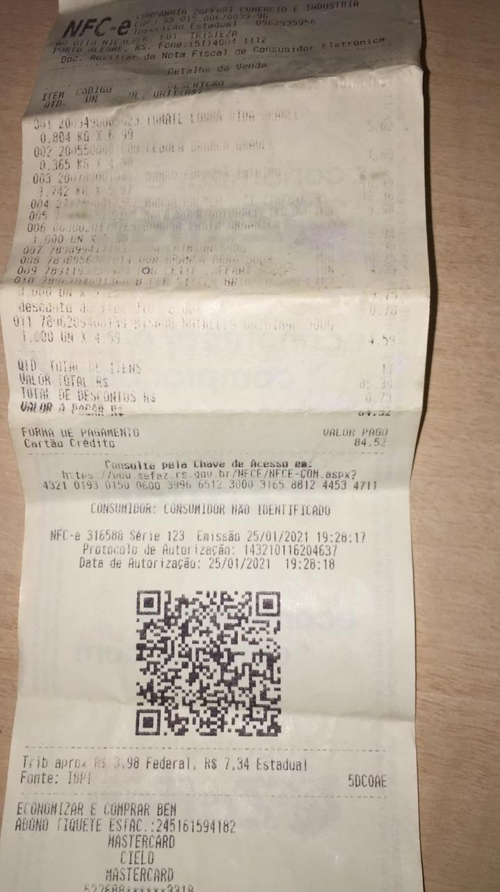
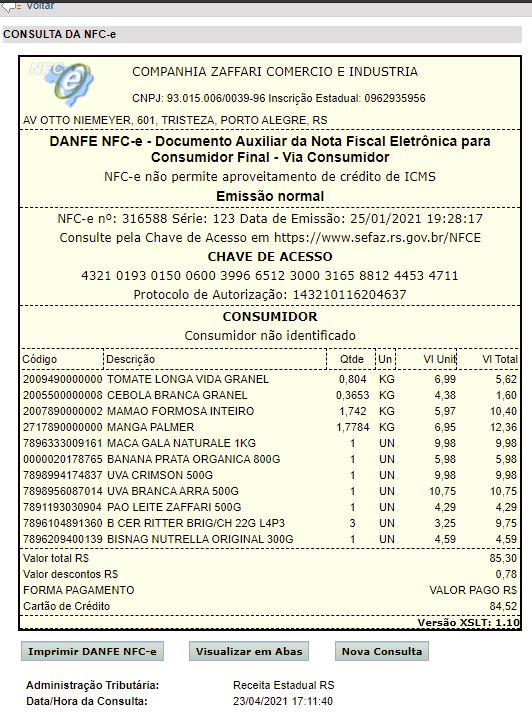

### Nota Fiscal Eletrônica do Consumidor (NFC-e) Scrap
No Brasil, toda vez que um produto é comprado em uma loja, o cliente recebe um documento denominado nota fiscal eletrônica (NFC-e).
Neste documento existe um QRCode, com o endereço eletrônico do documento que foi recebido com todos os itens que foi comprado.

A ideia desse trabalho é disponibilizar o conteúdo da NFC-e em um dataframe que seja facilmente transformado em uma planilha excel.

### Client Eletronic Ticket Payment (NFC-e) Scrap
In Brazil, every time that a product is purchased at a store, the customer you receive a document called electronic invoice (NFC-e).
In this document there is a QRCode, with the electronic address of the document that was received with all items that was buiyng.

The idea of this work is to make the NFC-e content available in a dataframe that is easily transformed into an excel spreadsheet.

### The fisical document:

### QRCode address:
https://www.sefaz.rs.gov.br/NFCE/NFCE-COM.aspx?p=43210193015006003996651230003165881244534711%7C2%7C1%7C1%7C816163C18D6D59DB901C3CAC9DE3D4776283E09B

### The digital document:

### OBS:
 - Each Region of Brazil (States) has you own way to store the NFC-e. We need a single screat for eache state ( 27 + DF).
 - Some Regions use captcha, other no.

### TODO:
 - Configure the streamlit-webrtc (https://github.com/whitphx/streamlit-webrtc/) to read the QRCode on Streamlit.
 - 